# Agent Illustrator

A declarative illustration language for AI agents. Describe *what* to draw, not *how* to render it. I use this to generate powerpoint-like illustrations when creating presentations with markdown+MARP.

## The Problem

AI agents can generate two kinds of visual output:

1. **Diagram DSLs** (Mermaid, D2, PlantUML) — Work reliably, but only for predefined diagram types
2. **Low-level graphics** (SVG, TikZ) — Can draw anything, but LLMs fail with coordinates and spatial reasoning

Agent Illustrator fills the gap: a **general-purpose** language that is **LLM-friendly**.

## Examples

**Software Architecture** — Agent-generated from a codebase scan. Constraint-based layout with templates, curved routing via waypoints, and background zones.

[](examples/architecture.ail)

**Feedback Loops** — Curved connections, stacked layouts, and semantic coloring for a human-agent interaction flow.

[](examples/feedback-loops.ail)

**MOSFET Driver Schematic** — Electronics schematic with custom component templates (resistor, LED, MOSFET), anchor-based wiring, and IEEE 315 symbols.

[](examples/mosfet-driver.ail)

**Railway Topology** — Three-level abstraction (network / line / station) using nested row/col layouts and connection routing.

[](examples/railway-topology.ail)

Click any image to view its `.ail` source. More examples: `agent-illustrator --examples`

## Installation

You can grab the binary directly from the releases page, but using nix is so much easier (and easier to integrate in other workflows)

### Nix (Linux & macOS)

```bash
# Run directly without installing
nix run github:kervel/agent-illustrator -- --help

# Install to your profile
nix profile install github:kervel/agent-illustrator
```

If flakes aren't enabled by default:
```bash
nix --extra-experimental-features 'nix-command flakes' run github:kervel/agent-illustrator
```

### Pre-built Binaries

Download from [GitHub Releases](https://github.com/kervel/agent-illustrator/releases):
- Linux (x86_64, aarch64)
- macOS (x86_64, aarch64)
- Windows (x86_64)

### From Source

```bash
cargo install --git https://github.com/kervel/agent-illustrator
```

## Quick Start

```bash
# Render a file
agent-illustrator diagram.ail > diagram.svg

# Show grammar reference
agent-illustrator --grammar

# Show annotated examples
agent-illustrator --examples

# Use with an AI agent (outputs a skill prompt)
agent-illustrator --skill
```

## Features

- **Semantic layouts**: `row`, `col`, `stack`, `grid` — describe structure, not coordinates
- **Constraint positioning**: `constrain a.left = b.right + 20` for precise control
- **Smart connections**: `a -> b` routes automatically, supports curved paths with `via:` waypoints
- **Templates**: Reusable components with parameters and internal anchors
- **Styleable colors**: `accent-dark`, `secondary-light` — swap palettes with `--stylesheet`

## AI Agent Integration

Agent Illustrator ships with built-in LLM support:

```bash
# Get a skill prompt for your agent
agent-illustrator --skill

# Get the full grammar reference
agent-illustrator --grammar

# Get annotated examples
agent-illustrator --examples
```

Pass `--skill`, `--grammar`, and `--examples` as context to your AI agent, or just tell your agent to figure it out himself (which should lead to the same). The skill prompt includes a 6-phase design methodology that guides the agent from intent to implementation. Tested with codex GPT-5.2-codex and Claude Opus 4.5.

## About

Built as an experiment in [specswarm](https://specswarm.com/)-driven development:
- No manual coding or code reviews — only specification-driven agent work
- Claude autonomously implemented features from specs, sometimes working over an hour without intervention
- The grammar/parser was agent-designed and turns out to be ergonomic despite being naive

## License

MIT
