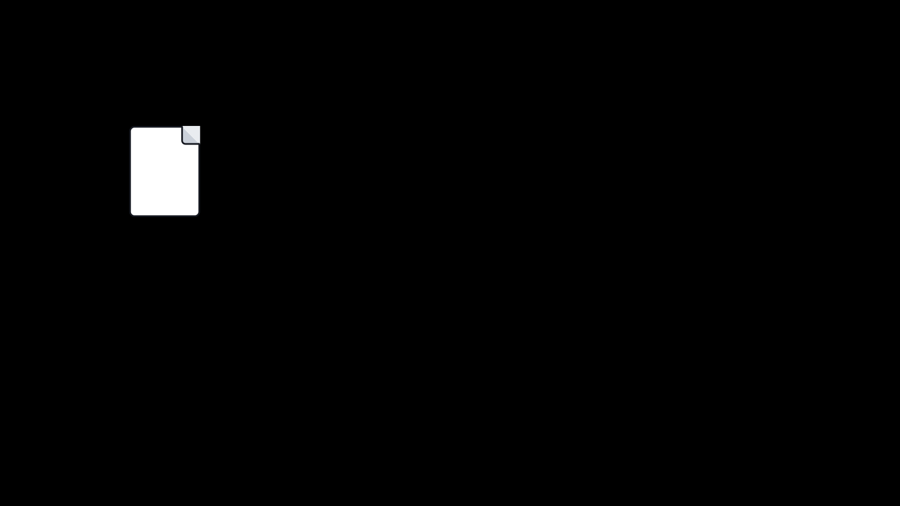
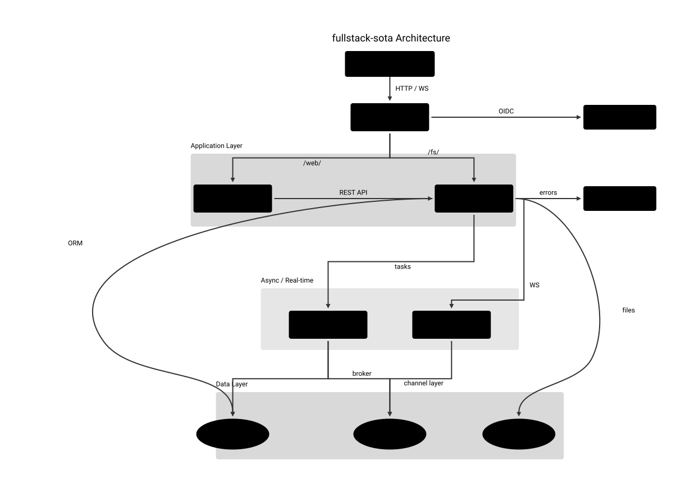
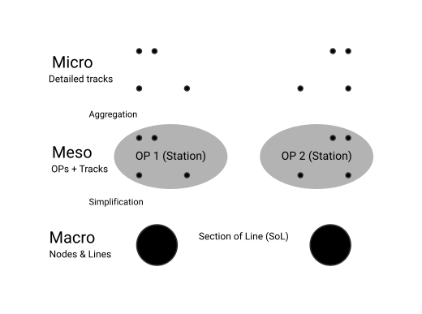
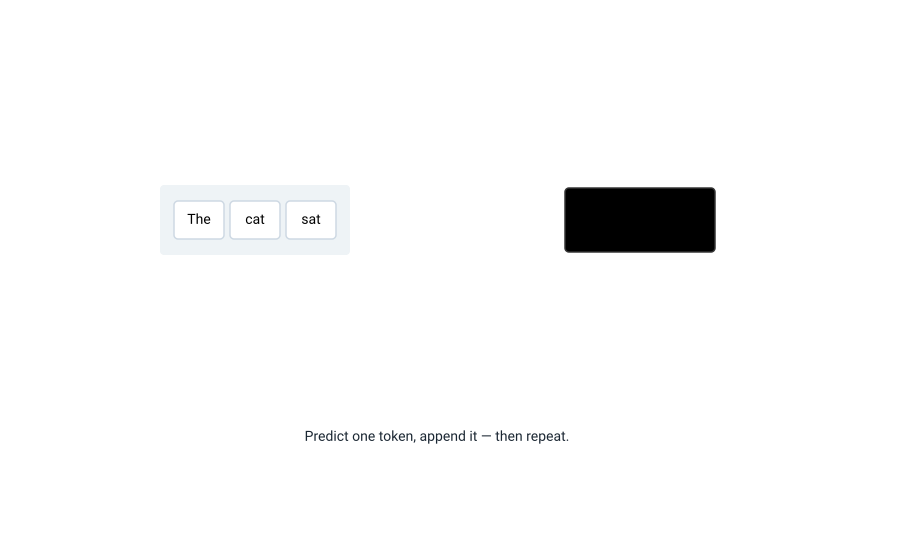

# Agent Illustrator

A declarative illustration language for AI agents: describe *what* to draw and
*how the story unfolds*, not coordinates. An agent writes a scene once; the
engine lays it out, animates it and checks it. I use it for the explainer
slides of a workshop deck (reveal.js / MARP).

[](examples/motion/git-branches.ail)

| | |
|:---:|:---:|
| [](examples/motion/git-copies.ail) | [](examples/motion/git-snapshots.ail) |
| **Copies everywhere**: copies fly out, then flip into code files | **Snapshots**: commits land on a timeline; go back one |
| [](examples/motion/git-history.ail) | [](examples/motion/git-merge.ail) |
| **Clone, commit, push, pull**: one history, many copies | **Merge**: code blocks, a conflict opens and resolves |

Every image above is a plain SVG playing a pure-CSS loop (`--animate-css`), so
it runs inside an `` on GitHub. With `--animate`, the same scene gets a
player that steps on click, as in a slide deck. Click an image for its source.

## What this is

- **Constraints, not coordinates.** `row`, `col`, `grid`, templates and
  `constrain card.left = file.right + 70` place things; the solver works out
  where. Relabel a station and everything moves to make room.
- **Motion that says what it waits for.** Keyframes are the click steps;
  inside them, `when main_line reaches a.dot { … }`, `when mr shown { … }`,
  named layouts (`use layout beside`) and component states (`set review
  approved`) describe the choreography. It compiles to explicit tracks.
- **One player, native stills.** The browser player, a deck host and the
  native renderer play the same tracks: `--frame 3 --at 50%` renders the exact
  still the browser shows at that moment.
- **Checked, not eyeballed.** `--lint` catches what agents get wrong: overlaps,
  labels that don't fit, a station popping before its line arrives, a swap to
  something elsewhere, cumulative timing. `--states` prints the storyboard per
  click step, so a scene can be verified as text.

## A scene, as written

The motion part of the branches scene above (the full file:
[git-branches.ail](examples/motion/git-branches.ail)):

```
template "check" (says: "check", then_says: "") {
    rect bg [fill: role-warn, fill_opacity: 0.28, stroke: none, opacity: 0]
    row item { circle tick [size: 28, label: "✓", appears: later]  rect txt [label: says] }
    state passed   { transform self [opacity: 1]; show tick [enter: pop] }
    state asked    { transform self [opacity: 1]; transform bg [opacity: 1] }
    state approved { transform self [opacity: 1]; transform txt [label: then_says, swap: fade]
                     after 0.1 { show tick [enter: pop] } }
}

path main_line [through: [a.dot, b.dot, c.dot, hotfix.dot, merged.dot], drawn: 0, ...]
path branch [through: [c.dot, l1.dot, l2.dot, l3.dot, merged.dot], routing: metro, drawn: 0, ...]

keyframe "main" {
    slide_in(s)
    at 0.25 { draw main_line [to: c.dot, duration: slow] }
    when main_line reaches a.dot { station(a) }
    when main_line reaches b.dot { station(b) }
    when main_line reaches c.dot { station(c) }
}
keyframe "review" {
    show mr [enter: pop]
    when mr shown + 0.1 { set tests passed }
    when tests.tick shown { set review asked }
}
keyframe "fixed" {
    draw branch [to: l3.dot, duration: fast]
    when branch reaches l3.dot { station(l3) }
    when l3.dot shown { set review approved }
}
keyframe "merge" {
    show gate [enter: draw, duration: fast]
    when gate shown { draw branch [duration: 0.6] }
    when gate shown + 0.1 { draw main_line [duration: slow] }
    when main_line reaches merged.dot { station(merged) }
}
```

And what `agent-illustrator --states git-branches.ail` says it does (trimmed):

```
changes per step:
  step 0 (main):
    + s.badge, s.heading, a.dot, a.nm, b.dot, b.nm, c.dot, c.nm, main_tag
    / main_line drawn to c.dot
  step 3 (review):
    + mr, tests.tick
    ~ review [opacity: 1]
    ~ review.bg [opacity: 1]
  step 4 (fixed):
    + l3.dot, l3.nm, review.tick
    ~ review.bg [opacity: initial]
    ~ review.txt [label: "Approved by Ben"]
    / branch drawn to l3.dot
  step 5 (merge):
    + merged.dot, merged.nm, gate
    / branch drawn 100%
    / main_line drawn 100%
```

## Diagrams

The same engine without keyframes draws diagrams that no fixed-type diagram
tool covers.

| | |
|:---:|:---:|
| [](examples/architecture.ail) | [](examples/mosfet-driver.ail) |
| **Software architecture**: templates, constraint layout, curved routing | **Schematic**: component templates, anchor-based wiring |
| [](examples/feedback-loops.ail) | [](examples/gallic-wars-timeline.ail) |
| **Feedback loops**: curved connections, semantic colour | **Timeline**: alternating cards, emphasis |
| [](examples/railway-topology.ail) | [](examples/token-prediction.ail) |
| **Railway topology**: nested layouts, routing | **Next-token prediction** (animated): a growing input, connectors that follow |

All images are rendered from the sources by `bash examples/render-all.sh`
(listed in [examples/renders.txt](examples/renders.txt)); a test fails when a
committed image is out of date. More: `agent-illustrator --examples`.

## Installation

You can grab the binary directly from the releases page, but using nix is so much easier (and easier to integrate in other workflows)

### Nix (Linux & macOS)

```bash
# Run directly without installing
nix run github:kervel/agent-illustrator -- --help

# Install to your profile
nix profile install github:kervel/agent-illustrator
```

If flakes aren't enabled by default:
```bash
nix --extra-experimental-features 'nix-command flakes' run github:kervel/agent-illustrator
```

#### Getting a new release

Nix caches the resolved revision of a flake reference, so after a release lands
you keep building against whatever you last fetched — silently, and for as long
as the cache entry lives. Force a refetch once:

```bash
nix --option tarball-ttl 0 run github:kervel/agent-illustrator -- --version
```

`--version` reports the release tag for a released binary, so it is the quickest
way to confirm which one you actually have.

### One file, no dependencies (Linux)

The Linux binaries are static: they run in any container or agent sandbox
with nothing else installed (no browser, no fonts, no libc).

```bash
curl -fsSL -o agent-illustrator https://github.com/kervel/agent-illustrator/releases/latest/download/agent-illustrator-linux-x86_64
chmod +x agent-illustrator    # aarch64: agent-illustrator-linux-aarch64
```

### Pre-built Binaries

Download from [GitHub Releases](https://github.com/kervel/agent-illustrator/releases):
- Linux (x86_64, aarch64; static)
- macOS (x86_64, aarch64)
- Windows (x86_64)

### From Source

```bash
cargo install --git https://github.com/kervel/agent-illustrator
```

## Quick Start

```bash
agent-illustrator diagram.ail > diagram.svg            # render
agent-illustrator scene.ail --animate > scene.svg      # with the step player
agent-illustrator scene.ail --animate-css > loop.svg   # a self-playing loop (READMEs)
agent-illustrator scene.ail --serve                    # live preview, reloads on save
agent-illustrator scene.ail --states                   # the storyboard, as text
agent-illustrator scene.ail --timeline                 # when everything happens
agent-illustrator scene.ail --frame 2 --at 50%         # a still, mid-motion
agent-illustrator scene.ail --frame 2 --png -o f.png   # a PNG to look at (no browser needed)
agent-illustrator scene.ail --lint                     # what an agent should fix
```

## AI Agent Integration

Agent Illustrator ships its own documentation for agents:

```bash
agent-illustrator --skill              # the design method and the language
agent-illustrator --skill-animation    # keyframes, motion, the git deck library
agent-illustrator --skill-styling      # themes, roles, CSS
agent-illustrator --grammar            # the full reference
agent-illustrator --examples           # annotated examples
```

Pass these to your agent as context, or tell it to run them itself. The skill
guides the agent from intent to a lint-clean result.

## About

Built as an experiment in [specswarm](https://specswarm.com/)-driven development:
- No manual coding or code reviews — only specification-driven agent work
- Claude autonomously implemented features from specs, sometimes working over an hour without intervention
- The grammar/parser was agent-designed and turns out to be ergonomic despite being naive

## License

MIT
